<h1 align="center">
  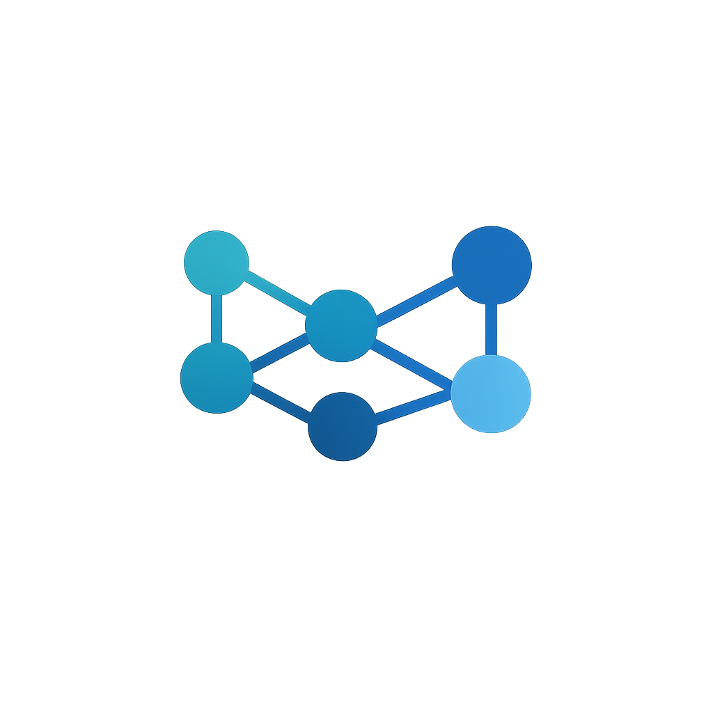 AUN Nodes Collection
</h1>

A comprehensive collection of custom nodes for ComfyUI which helps you to create compact, well-organised workflows. Includes a bunch of bypass/mute/collapse controllers, automatic file naming and saving, clever index-driven prompting that matches specific LoRAs to specific prompts. With in-built trigger words management, CivitAI lookup and lots more!

Many of the nodes feature a 'compact mode', which hides all the widgets, except for those you need to see, for a cleaner workflow. Selected nodes also feature a 'collapse connections' mode, which hides output labels and converges all output connection lines to a single point while keeping the node compact.

My newest addition is a brilliant image compare node that accepts up to 5 pairs of image inputs, with auto naming of left and right image pairs for easy comparison.

Another fantastically useful addition is the Show Any Multi node. It will accept any input type and display a text preview, or image preview, with the name of the connected output slot as a caption. Not only that, it accept and shows up to 20 mixed inputs and display the previews of all 20 in the same node! (There's also a node that passes through the inputs as string outputs).

## 🧭 Browse by Category

Jump straight to the node group you need:

- [Node Control](#cat-node-control)
  - [Toggle & Emoji Conventions](#cat-toggle)
- [Prompts](#cat-prompts)
- [File Management](#cat-file-management)
- [LoRA](#cat-lora)
- [Image](#cat-image)
- [Video](#cat-video)
- [KSampler](#cat-ksampler)
- [Loaders](#cat-loaders)
- [Loaders+Inputs](#cat-loaders-inputs)
- [Logic](#cat-logic)
- [Text](#cat-text)
- [Utility](#cat-utility)

Also see: [💡 Example Workflows](#cat-examples) · [🚀 Getting Started](#cat-getting-started) · [📚 Documentation](#cat-documentation) · [❓ FAQ](#cat-faq)

---

## 💡 Example Workflows

### Prompt Cycling with Multi-LoRA Selection

Use `AUN PromptCycler` with `AUN Random Multi-LoRA Model Loader` to cycle through prompts while dynamically applying different LoRA combinations per prompt.

[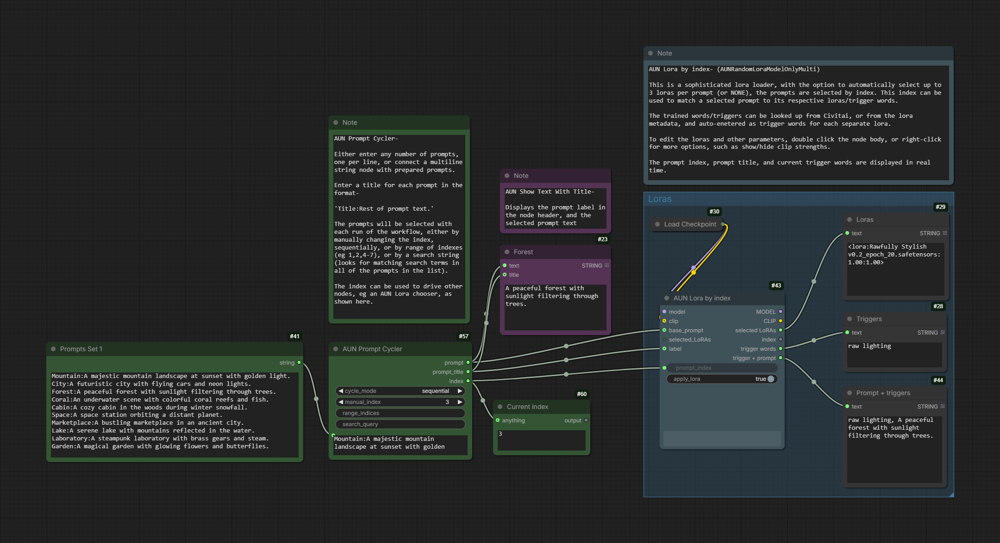](docs/example_workflows/AUNExampleWF-PromptCycler-LorasByIndex.png)

1. Add `AUN PromptCycler` and set its mode (Sequential, Random, Search, etc.).
2. Connect its `prompt` output to your CLIP Text Encode node.
3. Add `AUN Random Multi-LoRA Model Loader` and configure per-prompt LoRA slots with trigger words and strengths.
4. Wire the cycler's `index` output to the LoRA loader's `prompt_index` input.
5. Run the queue — each prompt change automatically selects the corresponding LoRA set, along with any trigger words needed.

Your setup: `AUN PromptCycler` -> `AUN Random Multi-LoRA Model Loader` -> `Model`/`CLIP` -> `KSampler`

### Showing & Passing Through Any Data with Show Any Multi

Use `AUN Show Any Multi` to display any kind of data (Model, CLIP, VAE, strings, integers, images, and more) in one place, and `AUN Passthrough Any Multi` to also pass text representations of that data through to its outputs.

[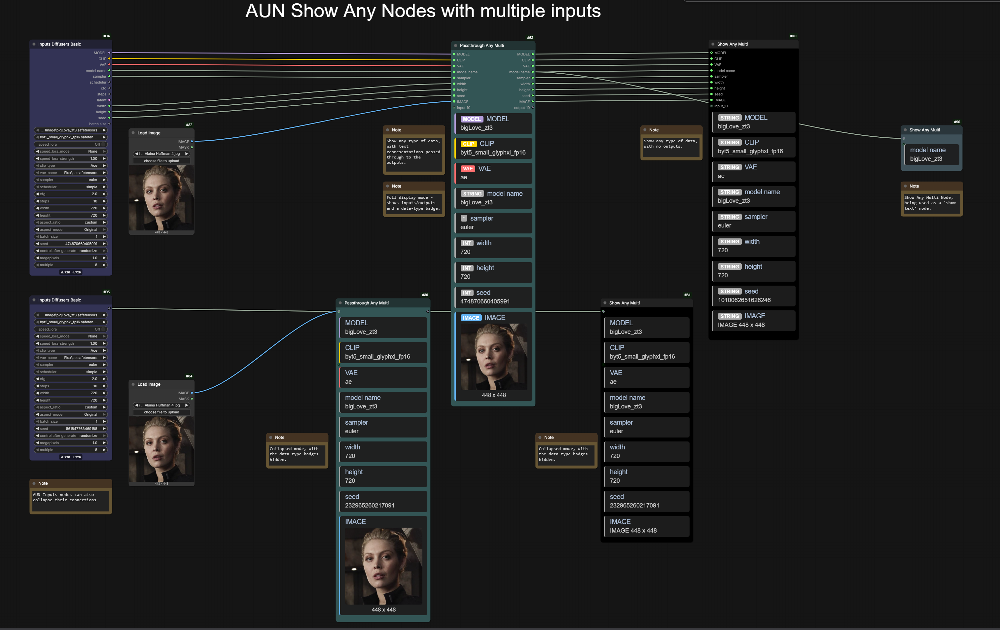](docs/example_workflows/AUNExampleWF-ShowAnyMulti.png)

1. Add `AUN Show Any Multi` (`AUNShowAnyMulti`) and connect the data you want to inspect to its inputs (up to 20 autogrow inputs).
2. To forward the data (or its text representations) on, add `AUN Passthrough Any Multi` (`AUNPassthroughAnyMulti`) and connect the same inputs; its `STRING` outputs carry each value as text.
3. Right-click `AUN Show Any Multi` to toggle the data-type badges on/off; double-click the node body to switch between full and collapsed modes.

Your setup: `Model`/`CLIP`/`VAE`/`String`/`Image` -> `AUN Show Any Multi` / `AUN Passthrough Any Multi`

### AUN Inputs Bundle: One Node for the Whole Pipeline

Use `AUN Inputs` to replace the checkpoint loader and the KSampler's settings with a single node — model, CLIP, VAE, latent, sampler, scheduler, CFG, steps, seed and more from one place.

[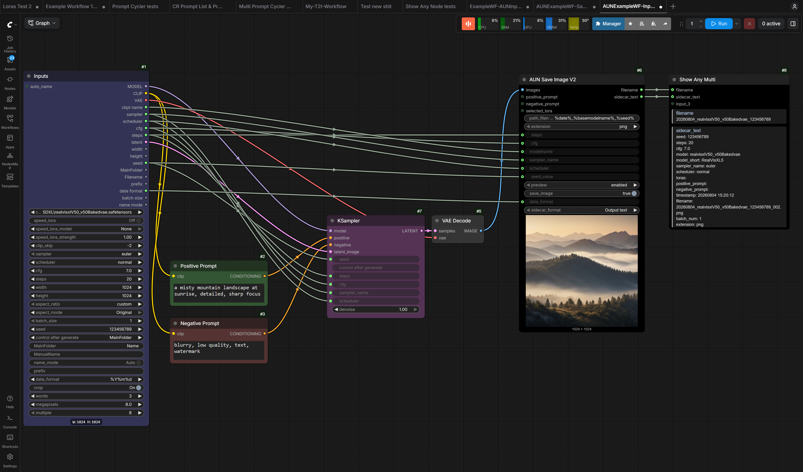](docs/example_workflows/AUNExampleWF-Inputs.png)

1. Add `AUN Inputs` (`AUNInputs`) and pick your checkpoint.
2. Connect `MODEL`/`CLIP`/`VAE` outputs to a standard `KSampler` pipeline.
3. Connect the `latent` output to the KSampler's `latent_image` input — no separate Empty Latent node needed.
4. Add positive/negative `CLIP Text Encode` nodes and connect them to the `CLIP` output.
5. Decode and save with `AUN Save Image V2` (`AUNSaveImageV2`), whose filename can embed the model, sampler, seed, etc.
6. Add `AUN Show Any Multi` (`AUNShowAnyMulti`) and connect the save node's `filename` and `sidecar_text` outputs to see the auto-generated filename and sidecar live without opening the file.

Your setup: `AUN Inputs` -> `KSampler` -> `VAE Decode` -> `AUN Save Image V2` -> `AUN Show Any Multi`

### Saving Images with Automatic Filenames via AUN Inputs Basic

Use `AUN Inputs Basic` to drive a standard KSampler pipeline, while `AUN Path Filename V2` auto-generates parameter-rich filenames (model, sampler, seed, steps, CFG...) that go straight into `AUN Save Image V2`.

[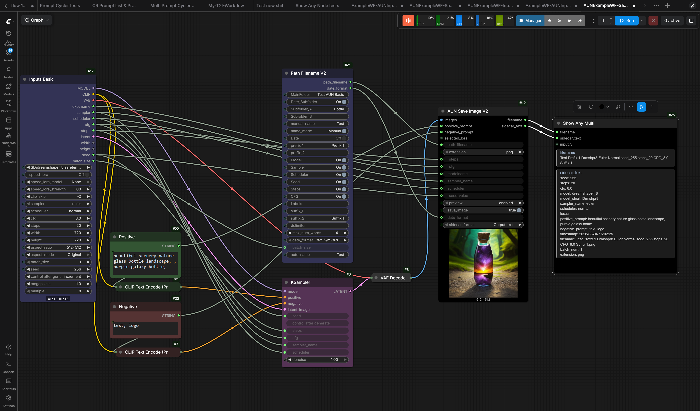](docs/example_workflows/AUNExampleWF-SavePipeline.png)

1. Add `AUN Inputs Basic` (`AUNInputsBasic`) and pick your checkpoint — it provides model, CLIP, VAE, sampler settings, and an empty latent in one node.
2. Add positive and negative `CLIP Text Encode` nodes and connect them to the `CLIP` output.
3. Connect `AUN Inputs Basic` outputs to a standard `KSampler`, then `VAE Decode` the result.
4. Add `AUN Path Filename V2` (`AUNPathFilenameV2`) and toggle which parameters appear in the filename (Model, Sampler, Scheduler, Seed, Steps, CFG).
5. Connect its `path_filename` output to `AUN Save Image V2` (`AUNSaveImageV2`).
6. Add `AUN Show Any Multi` (`AUNShowAnyMulti`) and connect the save node's `filename` and `sidecar_text` outputs to see the auto-generated filename and sidecar live.
7. Run — every image is saved under an automatic, self-describing filename.

Your setup: `AUN Inputs Basic` -> `KSampler` -> `VAE Decode` -> `AUN Save Image V2` (with `AUN Path Filename V2` -> `path_filename`)

### Prompt Selection & Add-To-Prompt

Use `AUN Text Index Switch 4`, `AUN Multi Negative Prompt` and `AUN Add-To-Prompt (Multi)` to pick positive/negative prompts dynamically and layer quality addons onto them, then watch the result live in `AUN Show Any Multi`.

[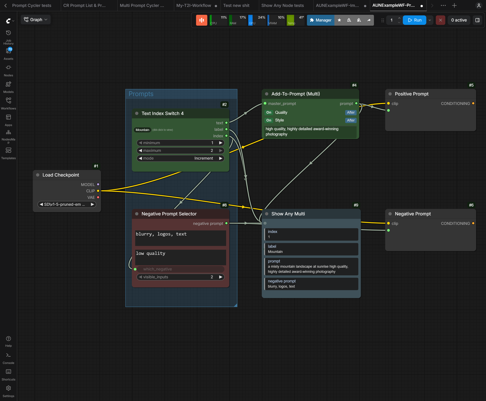](docs/example_workflows/AUNExampleWF-Prompts.png)

1. Add `AUN Text Index Switch 4` (`AUNTextIndexSwitch4`), fill in a few prompts, and set its mode to Increment (or Select/Random/Range).
2. Connect the switch's `text` output to `AUN Add-To-Prompt (Multi)` (`AUNAddToPromptMulti`) and turn its addons on/off/random to add quality text before or after the prompt.
3. Feed the combined `prompt` output into the positive `CLIP Text Encode`.
4. Add `AUN Multi Negative Prompt` (`AUNMultiNegPrompt`), fill in a few negative prompts, and connect the switch's `index` output to its `which_negative` input; connect the `negative` output to the negative `CLIP Text Encode`.
5. Wire the switch's `index` and `label`, the combined `prompt`, and the `negative` into `AUN Show Any Multi` (`AUNShowAnyMulti`) to see the active index, label, prompt and negative all in one place.

Your setup: `AUN Text Index Switch 4` -> `AUN Add-To-Prompt (Multi)` -> `CLIP Text Encode`; `AUN Text Index Switch 4` -> `AUN Multi Negative Prompt` -> `CLIP Text Encode`; and both -> `AUN Show Any Multi`

### Comparing Two Images Side-by-Side

Use `AUN Image Slider Comparer` (`AUNImageSliderComparer`) to compare two versions of an image — before/after, original vs upscaled, two generations — with a slider. Two modes are available: Drag (click and drag to scrub) and Slide (slider follows the mouse without clicking). Switch between them via the right-click menu.

[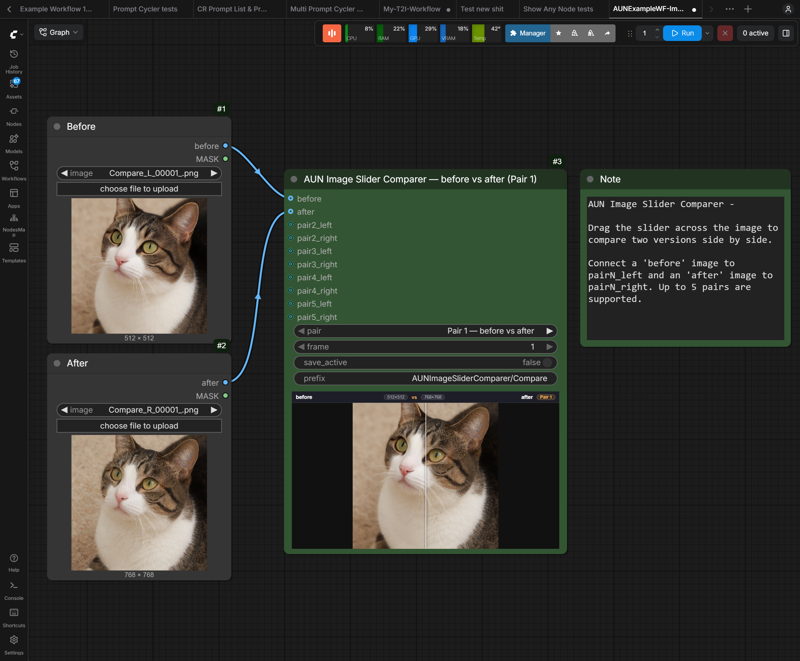](docs/example_workflows/AUNExampleWF-ImageSliderComparer.png)

1. Add two `Load Image` nodes and pick the images to compare.
2. Connect the first image to `pair1_left` and the second to `pair1_right` on `AUN Image Slider Comparer`.
3. Run the workflow — the node shows both images with a draggable divider, and labels each side with the name of the connected output.
4. Use the `Pair` dropdown to switch between up to five pairs and the `Frame` dropdown to step through frames (for batched or video inputs).
5. Right-click the left or right half of the image area to open or download that side's image.

Your setup: `Load Image` -> `AUN Image Slider Comparer` (`pairN_left` / `pairN_right`)

### KSampler Plus with Latent Upscaling

Use `AUN KSampler PlusV3` (`AUNKSamplerPlusv3`) for a two-pass sample with latent upscaling and an optional image upscale/refine pass, and compare the base vs upscaled result with `AUN Image Slider Comparer`.

[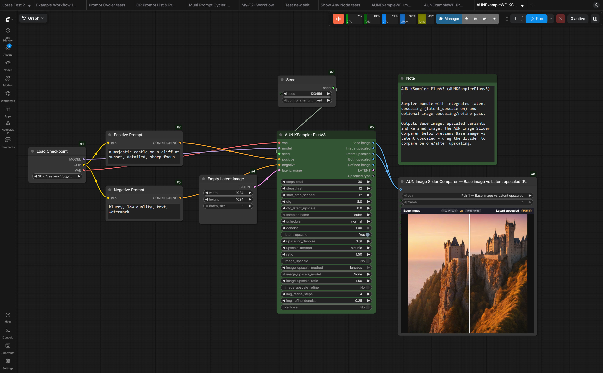](docs/example_workflows/AUNExampleWF-KSamplerPlus.png)

1. Add `AUN KSampler PlusV3` (`AUNKSamplerPlusv3`) and connect `model`, `CLIP`, `VAE`, positive/negative `CLIP Text Encode` outputs and a latent image (from `Empty Latent Image`).
2. Add a core `Seed` node and connect its `seed` output to the sampler's `seed` input for a fixed, reproducible seed.
3. Keep `latent_upscale` enabled to upscale the latent before the second pass, or enable `image_upscale` / `image_upscale_refine` for a pixel-space pass instead.
4. Connect `Base image` to `pair1_left` and `Latent upscaled` to `pair1_right` on `AUN Image Slider Comparer` (`AUNImageSliderComparer`).
5. Run — drag the divider on the comparer to compare the base render against the upscaled result.

Your setup: `Checkpoint Loader` + `CLIP Text Encode` + `Empty Latent Image` + `Seed` -> `AUN KSampler PlusV3` -> `AUN Image Slider Comparer`

## <!-- BEGIN: AUN_NODES_AUTO -->

## Node categories:

<h4>Node Control - Command the Flow</h4>

_AUN Node state controllers let you bypass, mute, and/or collapse nodes, keeping complex setups clean and fast:_

- AUN Node Controller (`AUNMultiUniversal`) is a universal bypass/mute/collapse controller (1–20 slots). Nodes are chosen by ID or titles. It can take on the role of any of the more specific Node Control nodes. Featuring Boolean outputs that can be used to switch other nodes at the same time. Also labels to show the state of the nodes for use in filenaming. There is also an All Switch, to toggle all at the same time, and different modes, such as 'max one', 'always one', 'increment' and 'random'.
- AUN Group Controller (`AUNMultiGroupUniversal`) targets ComfyUI Groups (by group name) rather than individual nodes, with various filtering options.
  The controller can show All Groups that it finds in the workflow, or the user can select which groups to show in the list. There is also an All Groups switch to toggle all groups at once.
- Both AUN Node Controller and AUN Group Controller can also run in `index-driven` mode, so another node can select the active slot via an `INT` output.
- Bypass By Title (`AUNSetBypassByTitle`) sets bypass state for one or more nodes whose titles match any of the provided titles (one per line).
- Mute By Title (`AUNSetMuteByTitle`) same as Bypass By Title but mute instead of bypass.
- Group Bypasser (Multi) (`AUNSetBypassStateGroup`) set the bypass state of all nodes in groups selected from the graph.
- Group Muter (Multi) (`AUNSetMuteStateGroup`) same as Group Bypasser but mute instead of bypass.
- Multi Bypass Index (`AUNMultiBypassIndex`) control bypass state of multiple nodes by IDs using an index. Selecting an index exclusively activates one set of nodes while bypassing all other sets.
- Multi Mute Index (`AUNMultiMuteIndex`) same as Multi Bypass Index but mute instead of bypass.
- Node Collapser & Bypasser Advanced (`AUNSetCollapseAndBypassStateAdvanced`) set collapse and bypass or mute state for multiple nodes. Has a combined override or separate toggles.
- Node State Controller (`AUNNodeStateController`) control collapse + bypass or mute for nodes by ID, group, or title.
- Collapse Connections (`AUNCollapseConnectionsController`) hides the input/output slots of chosen nodes to reduce link lines between them. Set up to 20 slots (label, targets, switch) plus an All-slots toggle; toggles apply instantly on the canvas and each targeted node's lines collapse into a single point. An 'All Graph' run-bar button (top action bar) hides connections for every node in the graph with 2+ connection slots at once. Double-click the node for compact mode. Requires the experimental 'Global collapse connections' setting (Settings → AUN) to be enabled; the node shows a warning overlay until it is.

##### Workflow image showing the many uses of the AUN Node/Group Controllers - (drop image into Comfyui to load the workflow)

[![Node controllers workflow diagram showing AUN Node Controller, AUN Group Controller, Bypass By Title, Group Bypasser Multi, Group Muter Multi, and Multi Bypass Index nodes connected with blue lines in a ComfyUI canvas. The diagram illustrates how to orchestrate bypass, mute, and collapse states across multiple nodes and groups within a workflow. Showing labeled node groups containing input/output sockets and configuration options, demonstrating practical control patterns for complex ComfyUI setups.](docs/images/node-controllers-workflow.png)](docs/images/node-controllers-workflow.png)

##### 🔁 Toggle & Emoji Conventions

To provide a fast, visually consistent understanding of node states, AUN nodes use standardized text+emoji labels for BOOLEAN inputs:

| Context                                   | label_on      | label_off                     | Meaning                                                                   |
| ----------------------------------------- | ------------- | ----------------------------- | ------------------------------------------------------------------------- |
| Bypass switches (per group / per title)   | `Active 🟢`   | `Bypass 🔴`                   | Active = node(s) participate; Bypass = skipped/disabled path              |
| Mute switches (per group / per title)     | `Active 🟢`   | `Mute 🔇`                     | Active = node(s) process; Mute = silenced (no processing / effect)        |
| Global (AllSwitch) for Bypass/Mute groups | `All 🟢`      | `Individual`                  | ON forces every listed group active; OFF defers to each individual switch |
| Model / generic on/off (where applicable) | `Active 🟢`   | `Off 🔴` (or domain specific) | Pattern reused when no special semantics                                  |
| Collapse / Expand (per node or group)     | `Collapsed ▶` | `Expanded ▼`                  | Collapsed hides node body (compact); Expanded shows full contents         |

<h4>Prompts</h4>

- Text Index Switch (`AUNTextIndexSwitch`) switch between up to 20 text inputs based on index number. Useful for dynamic prompt selection with control over how many sockets are visible on the node. Inputs take the title of the connected node, which is also used as the label.
- Text Index Switch 3 (`AUNTextIndexSwitch3`) select one of ten text inputs based on an index. Also outputs the label of the selected input.
- Text Index Switch 4 (`AUNTextIndexSwitch4`) switch between up to 20 text inputs with built-in mode selection (Select, Increment, Random, Range). Combines index generation and text switching in a single node, eliminating the need for a separate Random/Select INT node. Also outputs the label of the selected input and the active index.
- Text Index Switch 5 (`AUNTextIndexSwitch5`) like Text Index Switch 4 but additionally scans the selected text for `key=value` tokens (model, sampler, scheduler, cfg, steps, seed), outputs each as a typed value that can be fed into downstream nodes, and removes those tokens from the text output.
- Text Index Switch 5 Diffusers (`AUNTextIndexSwitch5Diffusers`) diffusers variant of Text Index Switch 5. Scans the selected text for diffusers-specific `key=value` tokens (diffusion_name, clip_name, vae_name, clip_type, sampler, scheduler, cfg, steps, seed) and outputs each as a typed value. The editor popup provides dropdown selectors for diffusion model, CLIP, VAE, and CLIP type files.
- Random Text Index Switch (`AUNRandomTextIndexSwitch`) generates an index based on the selected mode (Select: fixed value, Increment: cycling through range, Random: random within range) and uses it to select from up to 20 text inputs.
- AUN Random Text Index Switch V2 (`AUNRandomTextIndexSwitchV2`) combines index generation with text selection: generates an index by mode (Select, Increment, Random, or Range) and uses it to select from up to 20 text inputs, outputting the selected text, label, index, and an index-prefixed label.
- Random/Select INT (`AUNRandomIndexSwitch`) outputs an integer based on mode: Select for fixed value, Increment for cycling through range, Random for random value within range.
- AUNPromptCycler cycles through an infinite number of prompts with support for sequential, random, manual, range (e.g. `1,2,4-8,11`), and search modes. Supports custom titles via `Title: Prompt text` format. Emits `AUN_prompt_cycler_selected` WebSocket events for downstream compact-mode overlays.
- AUN Multi Prompt Cycler (`AUNMultiPromptCycler`) outputs all prompts matching a range or search query as lists, each element triggering its own downstream execution. Range mode takes comma-separated indices/ranges (e.g. `1,2,4-8,11`, `0` for all); search mode uses space=AND, comma=OR.
- Add-To-Prompt (`AUNAddToPrompt`) add text to either before or after a prompt, with a choice of always, never or 50/50 random.
- Add-To-Prompt Multi (`AUNAddToPromptMulti`) multi-addon prompt builder with up to 10 switchable addon slots. Each addon can be enabled/disabled individually and placed before or after the main prompt. Supports dynamic prompts and compact mode with overlay checkboxes and order selectors. TIP: Double-click the node or right-click and select 'Compact mode' to hide configuration widgets.
- AUN Wildcard Add-To-Prompt (`AUNWildcardAddToPrompt`) randomizes wildcard syntax (`__name__`, `{a|b|c}`) each execution, then conditionally adds the populated text to a prompt (always, never, or 50/50 random). A wildcard selector discovers and quick-inserts available wildcard tokens.
- Negative Prompt Selector (`AUNMultiNegPrompt`) selects one of the 10 preset negative prompts to use.
- Keyword Preset Selector (`AUNKeywordPresetSelector`) selects a preset value based on keyword matching in a reference phrase. Keywords are matched as substrings (case-insensitive by default); each keyword can be a comma-separated list, any one of which activates the row. First match wins (top-to-bottom order). Useful for automating workflow selection based on text analysis. Outputs the matched preset value, the matched keyword, and the matched index.
- Keyword FaceID Settings (`AUNKeywordFaceIDSettings`) selects FaceID/IPAdapter settings based on keyword matching in a reference phrase. Keywords are matched as substrings (case-insensitive by default); each keyword can be a comma-separated list, any one of which activates the row. First match wins (top-to-bottom order). Each preset row holds the 8 settings consumed by an IPAdapterUnifiedLoader + IPAdapterSimple + IPAdapterUnifiedLoaderFaceID + IPAdapterFaceID combination (e.g. a FaceIDPreset subgraph): preset, weight, weight_type, preset_faceid, lora_strength, weight_faceid, weight_faceidv2, weight_type_faceid. Outputs are typed so they can be wired straight into the subgraph's exposed inputs. Falls back to the *_default settings when nothing matches. A manual preset override (manual_preset + manual_priority) can force any of the six preset rows or the default bundle, either overriding matched keywords or acting as a fallback when nothing matches. settings_text renders the matched settings as a Python-style tuple for file naming.

<h4>File Management</h4>

- Path Filename V2 (`AUNPathFilenameV2`) is an image path/filename builder for generating image save paths and filenames, with manual/auto naming built in. It also emits a 'sidecar' (text or json) that shows the main parameters used.
You can toggle on/off whether to save various parameters in the filename, like Model, Sample, Seed, CFG etc.
Works best when coupled with AUN Save Image.
- Filename Resolver V2 (`AUNFilenameResolverPreviewV2`) allows the AUN path/filename builder nodes to connect to 'standard' save image/video nodes.
- Path Filename Video (Resolved) (`AUNPathFilenameVideoResolved`) builds the final resolved video filename and emits a 'sidecar' (text or json) that shows the main parameters used. Can be used with VHS Video Combine.
- Path Filename Video V2 (`AUNPathFilenameVideoV2`) is a video path/filename builder that emits `path_filename` plus `date_format`. For use with AUN Save Image/Video nodes.
- Main Folder Manual Name (`MainFolderManualName`) switches between a manual name and an automatic filename for the output path. Also returns the MainFolder, useful if you want to use the MainFolder in another node, and a boolean which can be used to switch other nodes.
- Path Filename (`AUNPathFilename`) is the legacy image path/filename builder for existing workflows, generating a file path and filename from image-focused components and placeholders. Kept only for backwards compatibility.
- Path Filename Video (`AUNPathFilenameVideo`) is the legacy video path/filename builder for existing workflows that still use separate outputs. Kept only for backwards compatibility.

<h4>LoRA</h4>

- Extract Power LoRAs (`AUNExtractPowerLoras`) extract LoRA names (and strengths) from rgthree Power Lora Loader nodes (and some other Lora loaders) in the graph/workflow.
- Random LoRA Model Loader (`AUNRandomLoraModelOnly`) selects one LoRA from up to 10 slots using Select, Increment, Random, or Range modes, applies it to the incoming model, and outputs the selected LoRA name plus trigger text. Optional CLIP input enables per-slot clip strength control. Compact mode with footer showing trigger words and menu options to hide/show clip strength. Its `base_prompt` is available as an optional external input for prompt chaining without cluttering compact mode.
- LoRA Loader Model Only (String) (`AUNLoraLoaderModelOnlyFromString`) loads a LoRA into a MODEL from a STRING input, resolving the name/path (subfolders or omitted extensions included). Useful when the standard loader's `lora_name` is COMBO-only and you need a dynamic string.
- Random Multi-LoRA Model Loader (`AUNRandomLoraModelOnlyMulti`) selects and applies multiple LoRAs based on prompt index, supporting up to 20 prompts with 3 LoRA slots each. Features compact mode with overlay UI for strength/trigger editing, drag-to-swap support for reordering LoRA slots, per-slot enable/disable toggles, and footer with combined trigger words display.
- LoRAs by Prompt Index (`AUNLoRAsByPromptIndex`) is the recommended successor to the Random Multi-LoRA Model Loader: same multi-prompt behavior plus a **no-empty-slots** display — empty LoRA dropdowns are hidden in full mode, so only configured LoRAs appear (purely cosmetic; execution is identical). It is purely index-driven (Select/Range/Random behavior comes from whichever upstream node supplies `prompt_index`). Its Setup dialog shows each prompt's configured slots with a single **＋ Add LoRA** row to fill the next empty slot.
- LoRA Stack With Triggers Model Clip (`AUNLoraStackWithTriggersModelClip`) stacks multiple LoRAs with per-slot trigger words and separate model/clip strength control. Supports up to 10 slots with full compact mode featuring overlay UI, drag-to-swap for reordering LoRA slots, and footer display. Successor to the deprecated AUNLoraStackWithTriggers with enhanced functionality.

<h4>Image</h4>

- Empty Latent (`AUNEmptyLatent`) generates an empty latent image with specified dimensions. It offers options for predefined aspect ratios, random width/height swapping, and batching, making it a flexible starting point for your image generation workflows.
- Image Loader (`AUNImgLoader`) loads an image and returns the image data, a mask, the original filename, and a cleaned filename. The cleaned filename is useful for prompts or file outputs in other nodes.
- Image Preview With Title (`AUNTitleImagePreview`) shows the image and also the filename actually as the node's title.
- AUN Image Title Multi Preview (`AUNImageTitleMultiPreview`) previews one or more images with optional filename labels drawn outside the image. For batched images, supply newline-separated filenames to label each frame; label position, size, alignment, and colours are configurable.
- Image Slider Comparer (`AUNImageSliderComparer`) compares up to five named pairs of images with a slider. Two interaction modes are available: Drag (click and drag to scrub) and Slide (slider follows the mouse without clicking, resets to the left edge on mouse leave) — switch via the right-click menu. Each input socket is labelled with the connected output-slot name, batched images (or lists of frames) are matched by index (a single-frame shows both sides). A Pair dropdown plus a Frame dropdown pick which pair/frame to view. The node title and an in-node header always show the active pair, with each side's dimensions shown next to its title. Right-click the node for full actions: **Open Left in New Tab**, **Download Left Image**, **Open Right in New Tab**, **Download Right Image** (or right-click directly on the left/right half of the image area for a per-side menu), plus **Collapse Connections** / **Show Connections** to toggle which widgets are hidden. Enabling `save_active` saves the displayed frame into the output folder with a configurable `prefix`.
- Img2Img (`AUNImg2Img`) provides a comprehensive Img2Img node, allowing you to switch between txt2img and img2img modes. It handles image loading, resizing, and encoding into the latent space, providing essential outputs for further processing.
- Load & Resize Image (`AUNImageLoadResize`) load images with optional automatic resizing. Supports FramePack nearest-bucket sizing, maintains aspect ratio, and provides filename information for workflow organization.
- Load Image Single/Batch 3 (`AUNImageSingleBatch3`) is a versatile way to either load a single uploaded image, or cycle through a batch of images from a folder - with multiple selection modes, including increment, random, range and search filtering by filename patterns.
- Manual/Auto Image Switch (`AUNManualAutoImageSwitch`) switches a filename and image output together. In Auto mode it passes through the source image and filename; in Manual mode it outputs `ManualName` and a generated placeholder image with optional overlay text and color controls.
- Resize Image (`AUNImageResize`) resize an input image using the same strategies as AUN Load & Resize Image, including FramePack buckets and fill/crop anchoring.
- Save Image *Deprecated* (`AUNSaveImage`) is the legacy image saver for workflows that still provide separate `path` and `filename` inputs.
- Save Image V2 (`AUNSaveImageV2`) is the recommended image saver with advanced filename customization and metadata embedding, accepting one combined `path_filename` input.

##### Workflow image showing the Image Slider Comparer - (drop image into Comfyui to load the workflow)

<h4>Video</h4>

- Save Video *Deprecated in favour of VHS Video Combine* (`AUNSaveVideo`) is the legacy video saver for workflows that still use the current `filename_format` input, combining image frames into animated images or video with token placeholders.
- Save Video V2 *Deprecated in favour of VHS Video Combine* (`AUNSaveVideoV2`) is the recommended video saver that combines image frames into animated images or video and accepts one combined `path_filename` input.
- RIFE Frame Interpolation (`AUNRIFE`) generates intermediate frames between input frames using RIFE (Real-Time Intermediate Flow Estimation) v4.7. Takes a batched IMAGE tensor and a multiplier (2–10) to produce smoother slow-motion or higher frame-rate sequences. Model weights (rife47 / rife49) are downloaded from HuggingFace to `ComfyUI/models/rife` on first use. Optional `ensemble` mode runs the model twice and averages results for better quality (slower).
- Audio Input Options *Deprecated* (`AudioInputOptions`) a deprecated helper that packages an audio path with clip start/duration settings for use by video nodes.

<h4>KSampler</h4>

- KSampler Inputs (`KSamplerInputs`) provides a convenient way to set the KSampler inputs (sampler, scheduler, CFG, and steps) in one place. This is useful for organizing your workflow and making it easier to manage these common parameters.
- KSampler Plus (`AUNKSamplerPlusv3`) a progressive two-pass sampler with latent-upscale, pixel-space upscale and optional final refinement. Also outputs a string of the selected upscale methods for use in filenames.
- KSampler 2-Model ('AUNKSamplerPlusv4') as KSampler Plus, but accepts a second model for the latent upscale process.
- AUN KSampler PlusV2 *Deprecated in favour of KSampler Plus* (`AUNKSamplerPlusV2`) an earlier progressive two-pass sampler with upscale options and optional final refinement.

##### Workflow image showing the KSampler Plus (v3) with an AUN Image Slider Comparer previewing Base vs Latent upscaled - (drop image into Comfyui to load the workflow)

<h4>Loaders</h4>

- Ckpt Load With Clip Skip (`AUNCheckpointLoaderWithClipSkip`) speaks for itself. Also outputs the model name.

<h4>Loaders+Inputs</h4>

- Inputs (`AUNInputs`) a comprehensive 'all-in-one' node for setting up a generation pipeline. It loads a checkpoint, creates a latent image, and prepares various parameters for sampling and saving, all in one place.
- Inputs Basic (`AUNInputsBasic`) is a lighter all-in-one setup node for loading a checkpoint, choosing sampler settings, and creating an empty latent batch.
- Inputs Basic + Prompt Switch (`AUNInputsBasicSwitch`) fuses a text index switch with Inputs Basic into a single node: select one of up to 20 text slots and load the checkpoint, latent and sampler settings in one place. `key=value` tokens in the selected text override the matching loader widgets and are removed from the text output.
- Inputs Diffusers (`AUNInputsDiffusers`) loads a standalone diffusion UNet with separate CLIP and VAE files, while keeping the fuller AUN Inputs-style naming and save-prep outputs.
- Inputs Diffusers Basic (`AUNInputsDiffusersBasic`) keeps the diffusion-only loading flow but strips it back to the lighter basic contract: model loading, sampler settings, and empty latent creation.
- Inputs Diffusers Refine Basic (`AUNInputsDiffusersRefineBasic`) extends the diffusion-only basic flow with an optional separate refine diffusion model while still avoiding the older naming and save-prep outputs.
- Inputs Refine (`AUNInputsRefine`) extends `Inputs` with an optional separate refine checkpoint and SpeedLoRA controls that can either split strength between models or apply full strength to both.
- Inputs Refine Basic (`AUNInputsRefineBasic`) keeps the lighter `Inputs Basic` contract but also outputs an optional separate refine model checkpoint.
- Inputs Hybrid (`AUNInputsHybrid`) loads a standard checkpoint (UNet+CLIP+VAE), or a diffusion UNet model with separate CLIP and VAE files, but essentially the same as AUN Inputs.

Migration note: existing workflows that use `AUNInputsRefine` or `AUNInputsRefineBasic` may need their SpeedLoRA-related widgets checked or reconnected after loading because the input set changed.

Deprecation note: the full input-style nodes (`AUNInputs`, `AUNInputsDiffusers`, and `AUNInputsHybrid`) are now considered legacy directionally, and future workflows should prefer the basic input nodes paired with `AUN Save Image V2` for a cleaner overall UX.

<h4>Logic</h4>

- Random Boolean (`AUNBoolean`) a Boolean switch with a third option: True, False, or Randomize. Outputs the resolved boolean and an optional label "True/False".

<h4>Text</h4>

- Manual/Auto Text Switch (`AUNManualAutoTextSwitch`) choose between an automatically generated filename and a manual name, and also output the mode boolean so related nodes can stay in sync.
- Name Crop (`AUNNameCrop`) crops a string to a specified number of words.
- Show Text With Title (`AUNShowTextWithTitle`) a show text node with a difference - shows text from an input, and dynamically sets the node's title from a text input upon execution. Useful when selecting from a list of text input nodes to see which one was selected.
- Single Label Switch (`AUNSingleLabelSwitch`) a simple boolean toggle with text label. Useful for adding the same text to more than one node.
- Strip (`AUNStrip`) trim digits and whitespace from the start and end of a string. Simple cleaner for building filenames or labels.
- String List Builder (`AUNStringListBuilder`) compiles up to 20 multiline strings (dynamic prompts supported) into a single string list. Pair with String List Index to select by index.
- String List Index (`AUNStringListIndex`) selects a string from a string list by a 1-based index. Connect the output of a String List Builder to its `string_list` input.
- Text Switch 2 Input With Text Output (`TextSwitch2InputWithTextOutput`) allows you to choose between 2 text inputs, or none, with text output. Labels can be customized.
  TIP: Double-click the node or right-click and select 'Compact mode' to hide configuration widgets.

<h4>Utility</h4>

- Any (`AUNAny`) a universal pass-through node that accepts any data type. Useful for workflow organization and flexible data routing.
- Show Any Multi (`AUNShowAnyMulti`) universal "show any" node that shows text, numbers, images, Model, Clip, VAE, etc. (with standard ComfyUI socket colors) and inline image previews for IMAGE inputs. Accepts up to 20 autogrow inputs. Features a collapse connections mode, and a right-click toggle to show/hide type badges.
- Passthrough Any Multi (`AUNPassthroughAnyMulti`) the 'show any' companion to Show Any Multi: inspects up to 20 inputs of any type (type name, string representation, and inline image previews for IMAGE inputs) and also passes each value's text representation through to its STRING outputs. Shares Show Any Multi's collapse connections mode and type-badge toggle.
- Scan And Show Widgets (`AUNScanAndShowWidgets`) scan any node by ID or title, display all its widget values as overlay cards inside the node, and provide up to 350 dynamic ANY-type output slots for wiring. Features a filter button (F) in the title bar with include/exclude wildcard patterns, a Select Widgets multi-select picker to pick the exact widgets to show, collapse connections mode, show/hide data type badges, and configurable max value length. Run the workflow (Queue Prompt) to populate the output slots and show the card details.
- AUN Bookmark (`AUNBookmark`) a bookmark node for AUN with precision zoom. Assign a key press and jump to a position in the workflow.
- AUNGraphScraper (`AUNGraphScraper`) extract multiple widget values from any node in the graph using {Node.Widget} syntax.
- AUN Any Index Switch (`AUNAnyIndexSwitch`) switch between up to 20 inputs of any type based on an index number. Only the selected input is evaluated and output. Also outputs the label of the selected input, taken from the connected node's title or the connected output slot's label.
- CFG Selector (`AUNCFG`) a CFG scale selector with finer control.
- Extract Model Name (`AUNExtractModelName`) extract a model name from a specific node (by numeric ID) for use in filenames.
- Extract Widget Value (`AUNExtractWidgetValue`) extract a widget/input value from a specific node by numeric ID and widget name.
- Get Active Node Title (`AUNGetActiveNodeTitle`) scans a user-defined list of node titles and outputs the title of the first node in that list which is currently active (not bypassed) in the workflow.
- Get Connected Node Titles (`AUNGetConnectedNodeTitles`) gets the titles of up to 10 connected nodes.
- Model Name Pass (`AUNModelNamePass`) a pass-through node for a MODEL that also extracts its name (full and shortened). Traces back to find the loader node.
- Model Name Shorten (`AUNModelShorten`) takes a full model name string and outputs a shortened version suitable for filenames.
- Model and Text Selector (`AUNRandomModelBundleSwitch`) selects one model slot and optional text/label pair using None, Select, Increment, Random, or Range modes, and also outputs the active slot index for downstream control nodes.
- Random Any Switch (`AUNRandomAnySwitch`) randomly selects one of several connected inputs of any type and outputs it, along with the index of the selected input.
- Random Number (`AUNRandomNumber`) generates random integers within specified range. Useful for seed variation and randomization in workflows.
- Switch Float (`AUNSwitchFloat`) switch between two float values based on boolean input. Useful for conditional parameter control and A/B testing.

## <!-- END: AUN_NODES_AUTO -->

---

### Notes

#### Collapse Connections

AUN Inputs nodes (`AUNInputs`, `AUNInputsBasic`, `AUNInputsRefine`, `AUNInputsRefineBasic`, `AUNInputsDiffusers`, `AUNInputsDiffusersBasic`, `AUNInputsDiffusersRefineBasic`, `AUNInputsHybrid`), AUN KSampler nodes (`AUNKSamplerPlusV2`, `AUNKSamplerPlusv3`, `AUNKSamplerPlusv4`) and Show Any Multi (`AUNShowAnyMulti`) feature a **collapse connections** mode that hides all slot labels and converges all connection lines to a single point, making complex workflows visually cleaner.

`AUNInputsBasicSwitch` also features collapse connections: its 13 param/loader outputs converge to a single point while the `text`, `label` and `index` switch outputs stay visible and keep their connections, so the node remains usable for its model/clip/vae/sampler plumbing and its prompt switching at the same time. Toggle it from the right-click menu ("Collapse Connections" / "Show Connections") or via a Collapse Connections controller node — double-click toggles its compact mode instead.

**Toggle**: Right-click → "Collapse Connections" / "Show Connections", or double-click anywhere on the node body (excluding the title bar and widgets). The node height reduces to match the collapsed slot area while preserving user-set width.

**Note**: This is distinct from ComfyUI's built-in title-bar collapse — the sockets remain functional, and connections are preserved; only the visual representation is compacted.

##### Before / After — Collapse Connections in action

| Workflow | Expanded | Collapsed |
|----------|----------|-----------|
| AUN Inputs Bundle |  | [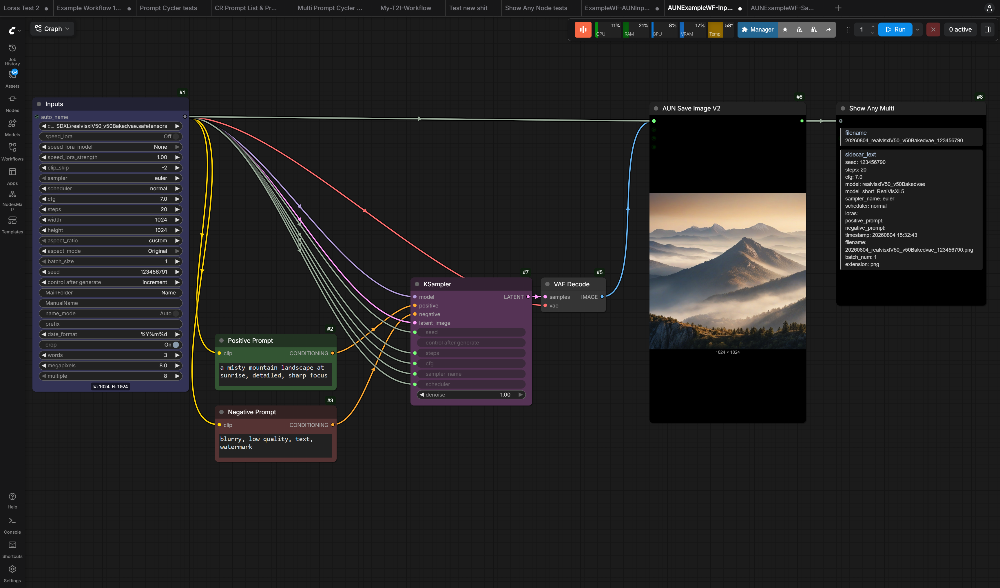](docs/example_workflows/AUNExampleWF-Inputs-Collapsed.png) |
| File Saving Pipeline |  | [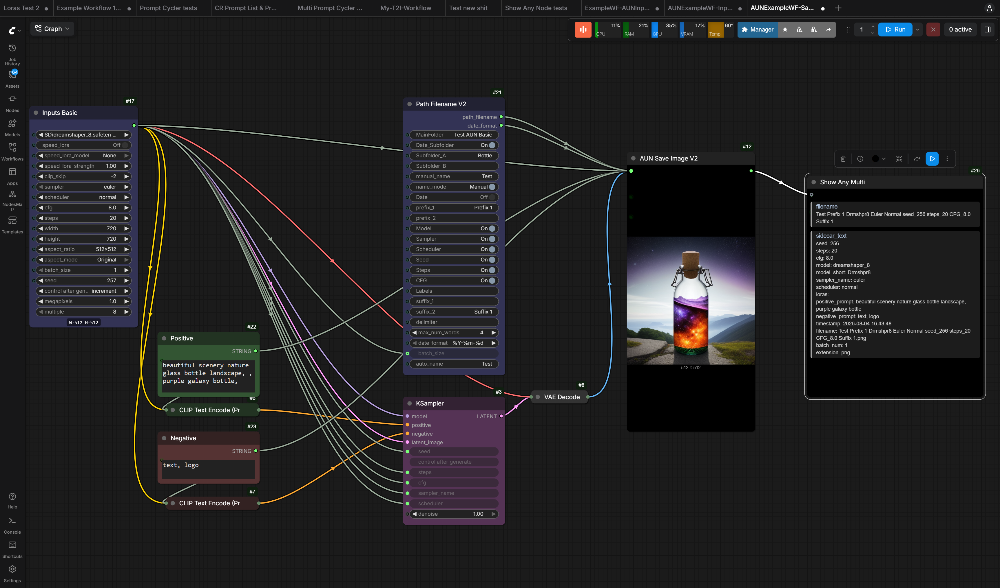](docs/example_workflows/AUNExampleWF-SavePipeline-Collapsed.png) |
| Prompts Showcase | [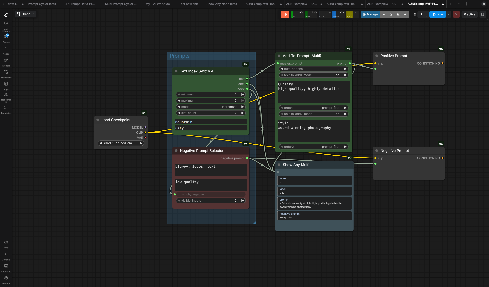](docs/example_workflows/AUNExampleWF-Prompts-NotCollapsed.png) |  |
| Image Slider Comparer |  | [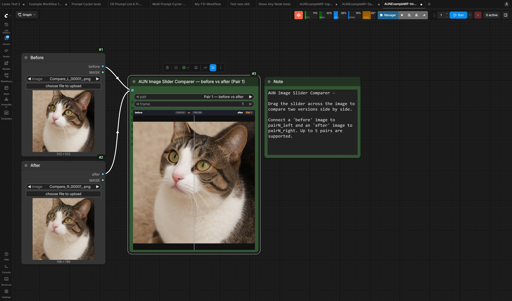](docs/example_workflows/AUNExampleWF-ImageSliderComparer-Collapsed.png) |

#### Global Collapse Connections (Non-AUN Nodes) — EXPERIMENTAL

> ⚠ **EXPERIMENTAL FEATURE** — This setting hooks into the rendering of **all non-AUN nodes** in the graph. It may cause visual or behavioural issues with core ComfyUI nodes or third-party custom node packs. If you notice anything unusual after enabling it, **disable the setting immediately**. Use at your own risk.

The same collapse connections behavior can be applied to **any non-AUN node** in your workflow via a ComfyUI setting.

**Enable**: Settings → AUN → "⚠ EXPERIMENTAL — Global collapse connections (compact socket lines)"

**Use**: Once enabled, double-click any non-AUN node body or right-click and select "Collapse Connections" / "Show Connections" to toggle per-node. User-set node sizes are preserved across toggles and browser refreshes.

**Scope**: AUN nodes that have their own Collapse Connections or Compact Mode implementations are unaffected — the setting only applies to nodes outside the AUN collection.

## 🚀 **Getting Started**

### Installation

Install into your ComfyUI `custom_nodes` directory, then restart ComfyUI.

#### Option A: ComfyUI-Manager (recommended)

- Use ComfyUI-Manager to install/update this repo:
  - Repo URL: `https://github.com/loz2754/AUN-ComfyUI-Nodes`

#### Option B: Manual (git clone)

From your ComfyUI folder:

- `cd custom_nodes`
- `git clone https://github.com/loz2754/AUN-ComfyUI-Nodes`

### ComfyUI-Manager

- AUN is compatible with ComfyUI-Manager installs.
- Runtime Python dependencies are declared in [requirements.txt](requirements.txt) (and [install.py](install.py) for Manager compatibility).
- If you install manually from git and see missing-module errors (e.g. `piexif`, `cv2`), install deps with:
  - `pip install -r custom_nodes/AUN-Comfyui-Nodes/requirements.txt`

### Basic Usage

1. Start simple: begin with AUNBoolean or AUNSaveImage
2. Explore categories to find nodes that match your needs
3. Read tooltips: hover inputs for guidance and expected values
4. Check documentation: refer to individual node READMEs for complex nodes

### Filename Workflow Compatibility

- Existing legacy path/filename nodes remain available for older workflows.
- For new image workflows, use `AUNPathFilenameV2` directly with `AUNSaveImageV2`, or route its `path_filename` into `AUNFilenameResolverPreviewV2` when you need a resolved filename for standard ComfyUI `Save Image`.
- For new video workflows, use `AUNPathFilenameVideoV2` directly with `AUNSaveVideoV2`.
- Canonical placeholder syntax is now `%token%` across AUN path/filename builders.
- Saver and resolver paths still accept legacy `%token` placeholders for backward compatibility.
- The new recommended non-breaking migration path is the V2 family, which standardizes on one combined `path_filename` string instead of separate `path` and `filename` sockets.
- Legacy nodes are kept intact so older workflows do not break.
- In node search, the older file-management/save nodes are labeled `Legacy` and the V2 replacements are labeled `Recommended`.

### Best Practices

- Organize workflows using collapse/bypass/mute group nodes
- Document settings with labels and descriptions
- Save frequently while configuring complex setups
- Test incrementally before chaining many nodes

## 🙏 Acknowledgements

AUN Nodes draw inspiration and code patterns from several excellent ComfyUI node projects. Special thanks to:

- **rgthree** (Power Lora Loader and related nodes)
- **WAS Node Suite** (was-nodes)
- **Impact Pack** (comfyui-impact-pack)
- **Video Helper Suite** (comfyui-videohelpersuite)

Their work has helped shape features, design, and best practices in this collection. Please check out their repositories for more great nodes and ideas!

## 📚 **Documentation**

### Individual Documentation

Complex nodes include detailed READMEs with examples and troubleshooting.

- Path Filename: [docs/AUNPathFilename_README.md](docs/AUNPathFilename_README.md)
- Path Filename Video: [docs/SaveVideoPathNode_README.md](docs/SaveVideoPathNode_README.md)
- Path Filename Video (Resolved): [docs/AUNPathFilenameVideoResolved_README.md](docs/AUNPathFilenameVideoResolved_README.md)
- Load Image Single/Batch 3: [docs/AUNImageSingleBatch3_README.md](docs/AUNImageSingleBatch3_README.md)
- Image Slider Comparer: [docs/AUNImageSliderComparer_README.md](docs/AUNImageSliderComparer_README.md)
- RIFE Frame Interpolation: [docs/AUNRIFE_README.md](docs/AUNRIFE_README.md)
- Manual/Auto Text Switch: [docs/AUNManualAutoTextSwitch_README.md](docs/AUNManualAutoTextSwitch_README.md)
- Manual/Auto Image Switch: [docs/AUNManualAutoImageSwitch_README.md](docs/AUNManualAutoImageSwitch_README.md)
- Random Text Index Switch: [docs/AUNRandomTextIndexSwitch_README.md](docs/AUNRandomTextIndexSwitch_README.md)
- Model and Text Selector: [docs/AUNRandomModelBundleSwitch_README.md](docs/AUNRandomModelBundleSwitch_README.md)
- Random LoRA Model Loader: [docs/AUNRandomLoraModelOnly_README.md](docs/AUNRandomLoraModelOnly_README.md)
- LoRAs by Prompt Index: [docs/AUNLoRAsByPromptIndex_README.md](docs/AUNLoRAsByPromptIndex_README.md)
- Extract Model Name: [docs/AUNExtractModelName_README.md](docs/AUNExtractModelName_README.md)
- Extract Power LoRAs: [docs/AUNExtractPowerLoras_README.md](docs/AUNExtractPowerLoras_README.md)
- Extract Widget Value: [docs/AUNExtractWidgetValue_README.md](docs/AUNExtractWidgetValue_README.md)
- Show Text With Title: [docs/AUNShowTextWithTitle_README.md](docs/AUNShowTextWithTitle_README.md)
- Group Bypasser (Multi): [docs/AUNSetBypassStateGroup_README.md](docs/AUNSetBypassStateGroup_README.md)
- Group Muter (Multi): [docs/AUNSetMuteStateGroup_README.md](docs/AUNSetMuteStateGroup_README.md)

### Tooltip System

All nodes include tooltips explaining parameters, expected values, and usage tips.

### Support

- Check node READMEs for details
- Use tooltips for quick reference
- See [CHANGELOG.md](CHANGELOG.md) for updates
- Maintainers: see `DOCUMENTATION_STRATEGY.md` for authoring guidelines

## ❓ FAQ / Troubleshooting

- `ModuleNotFoundError: piexif` / `ModuleNotFoundError: cv2`
  - Install dependencies: `pip install -r custom_nodes/AUN/requirements.txt` (or use ComfyUI-Manager’s dependency install).
- ffmpeg not found / some video outputs disabled - Install ffmpeg and ensure it’s on PATH, or install `imageio-ffmpeg` via [requirements.txt](requirements.txt).

- Windows long path / filename issues
  - Prefer shorter `MainFolder`/subfolder names and a compact filename format.

## 🔄 **Updates & Maintenance**

The AUN nodes collection is actively maintained with:

- Regular improvements and new nodes
- Documentation updates alongside changes
- Compatibility updates for ComfyUI

## 🤝 **Contributing**

Contributions are welcome! Please follow the documentation standards in `DOCUMENTATION_STRATEGY.md`, include tooltips for all parameters, and add READMEs for complex nodes.

See [CONTRIBUTING.md](CONTRIBUTING.md) for the practical workflow.

## 📄 License

Released under the MIT License. See [LICENSE](LICENSE).
